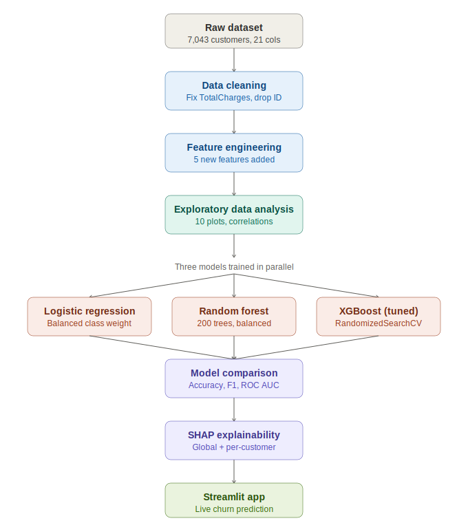
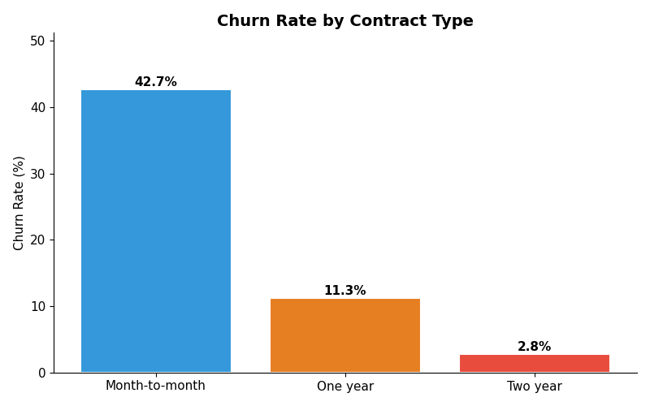
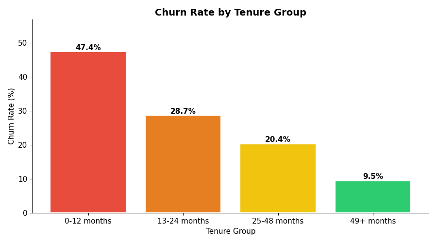
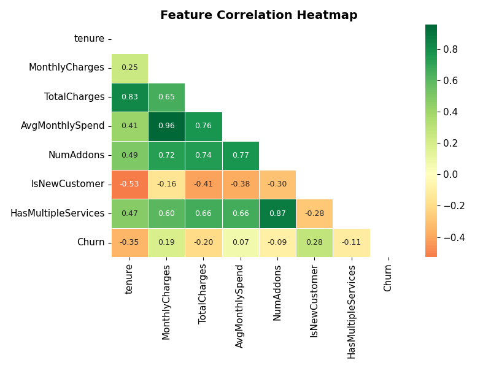
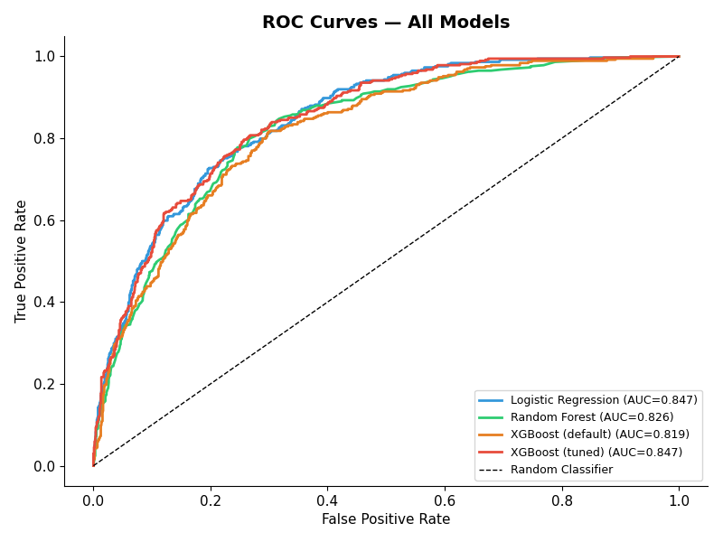
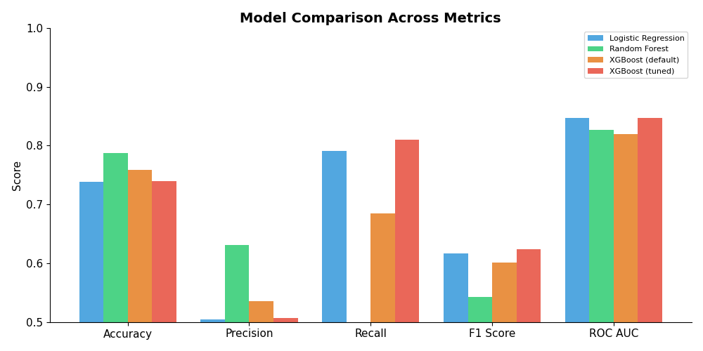
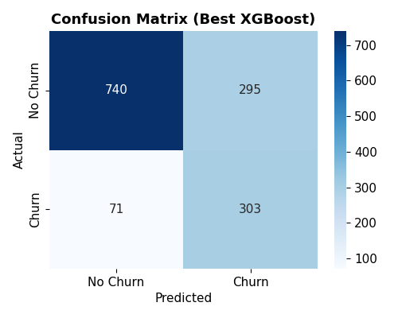
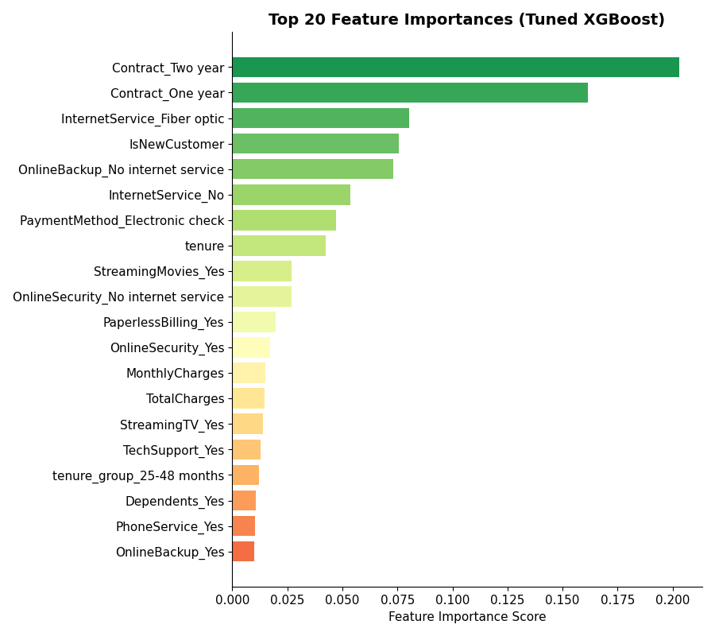
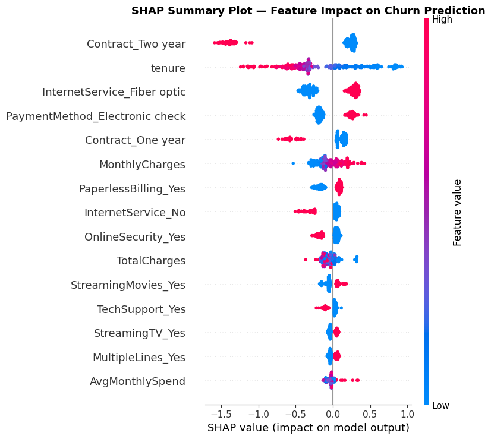
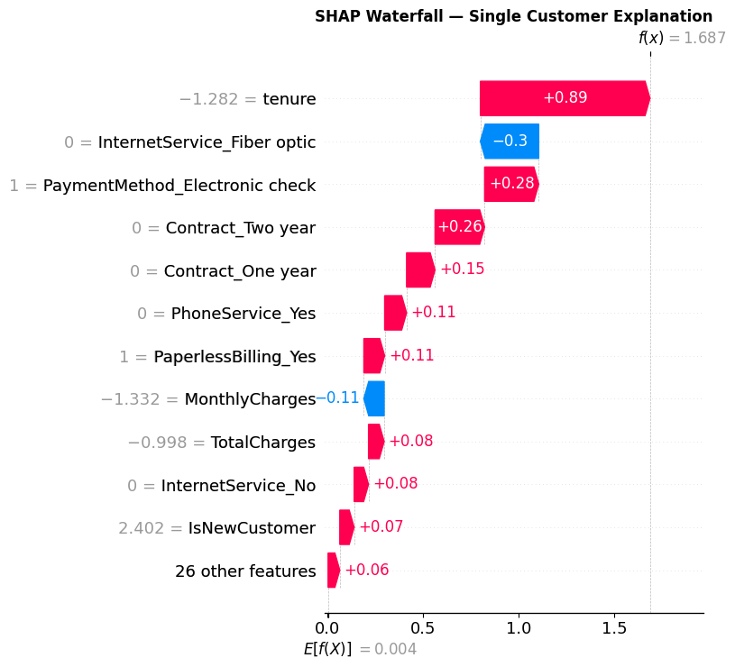

# 📡 Customer Churn Prediction — End-to-End ML Pipeline

[](https://www.python.org/)
[](https://scikit-learn.org/)
[](https://xgboost.readthedocs.io/)
[](https://streamlit.io/)
[](https://shap.readthedocs.io/)
[](LICENSE)

An end-to-end machine learning project that predicts whether a telecom customer will churn, explains **why** using SHAP, and serves live predictions through an interactive Streamlit dashboard.

**🔗 Live demo:** [Launch the app →](https://customer-churn-prediction-a6eabkqrsboofjidqnv6ky.streamlit.app/)

---

## 📋 Table of Contents

- [Project Overview](#-project-overview)
- [Dataset](#-dataset)
- [Workflow](#-workflow)
- [Exploratory Data Analysis](#-exploratory-data-analysis)
- [Model Comparison](#-model-comparison)
- [Feature Importance & Explainability](#-feature-importance--explainability)
- [Streamlit App](#-streamlit-app)
- [Installation](#-installation)
- [Project Structure](#-project-structure)
- [Deployment](#-deployment)
- [Key Findings](#-key-findings)
- [Tech Stack](#-tech-stack)

---

## 🎯 Project Overview

Customer churn — when a subscriber leaves a service — is one of the costliest problems in subscription businesses. Acquiring a new customer typically costs **5–7x more** than retaining an existing one, so being able to flag at-risk customers early has direct business value.

This project builds a full pipeline that:

1. Cleans and engineers features from raw telecom customer data
2. Trains and compares three classification models (Logistic Regression, Random Forest, XGBoost)
3. Tunes the best model with cross-validated hyperparameter search
4. Explains predictions with SHAP, both globally and per customer
5. Serves real-time predictions through a Streamlit web app

**Goal:** Given a customer's profile (contract type, tenure, services, billing), predict their probability of churning and surface the key drivers behind that prediction.

---

## 📊 Dataset

**Source:** [Telco Customer Churn](https://www.kaggle.com/datasets/blastchar/telco-customer-churn) (IBM sample dataset, via Kaggle)

| | |
|---|---|
| Rows | 7,043 customers |
| Columns | 21 features |
| Target | `Churn` (Yes / No) |
| Churn rate | 26.5% (imbalanced) |

**Feature categories:**
- **Demographics** — gender, senior citizen, partner, dependents
- **Account info** — tenure, contract type, payment method, billing
- **Services** — phone, internet, online security, backup, tech support, streaming
- **Charges** — monthly charges, total charges

---

## 🔄 Workflow

The pipeline below summarizes the project end to end, from raw CSV to a deployed app.



| Stage | What happens |
|---|---|
| **1. Data cleaning** | Fix `TotalCharges` (stored as string with blanks), drop `customerID`, encode target |
| **2. Feature engineering** | Add 5 derived features: `AvgMonthlySpend`, `tenure_group`, `IsNewCustomer`, `NumAddons`, `HasMultipleServices` |
| **3. EDA** | 10 visualizations covering distributions, correlations, and churn rate breakdowns |
| **4. Model training** | Logistic Regression, Random Forest, XGBoost — all with `class_weight`/`scale_pos_weight` to handle imbalance |
| **5. Hyperparameter tuning** | `RandomizedSearchCV`, 20 iterations, 5-fold CV, optimizing ROC-AUC |
| **6. Explainability** | SHAP summary plots, bar plots, and per-customer waterfall plots |
| **7. Deployment** | Streamlit app with live gauge chart and SHAP explanation per prediction |

---

## 🔍 Exploratory Data Analysis

**Churn distribution and contract type** — the clearest single driver of churn is contract length. Month-to-month customers churn at roughly **14x the rate** of two-year contract customers.



**Churn rate by tenure group** — new customers (0–12 months) are by far the highest-risk group, with churn dropping sharply as tenure increases.



**Feature correlation heatmap** — tenure is negatively correlated with churn, while `IsNewCustomer` and `MonthlyCharges` are positively correlated.



> Full EDA — including distribution plots and add-on service analysis — is available in [`CustomerChurn_Complete.ipynb`](CustomerChurn_Complete.ipynb).

---

## 🤖 Model Comparison

Four models were trained and evaluated on a held-out 20% test set. **Recall** is weighted heavily here, since failing to flag an actual churner (false negative) is more costly than a false alarm.

| Model | Accuracy | Precision | Recall | F1 Score | ROC AUC |
|---|---|---|---|---|---|
| Logistic Regression | 0.739 | 0.505 | 0.791 | 0.617 | **0.847** |
| Random Forest | 0.787 | 0.631 | 0.476 | 0.543 | 0.826 |
| XGBoost (default) | 0.759 | 0.536 | 0.685 | 0.601 | 0.820 |
| **XGBoost (tuned)** | 0.740 | 0.507 | **0.810** | **0.624** | **0.847** |

**Selected model: Tuned XGBoost** — chosen for its highest Recall (catches 81% of actual churners) and tied-best ROC-AUC.







---

## 🧠 Feature Importance & Explainability

Beyond raw performance metrics, this project uses **SHAP (SHapley Additive exPlanations)** to explain *why* the model makes each prediction — both at the global level and for individual customers.

**Global feature importance (XGBoost):**



**SHAP summary plot** — shows how each feature pushes predictions toward or away from churn across the dataset. Short tenure, month-to-month contracts, and fiber optic internet are the strongest churn signals.



**SHAP waterfall plot** — explains one individual prediction step by step, showing exactly which features pushed that specific customer's churn probability up or down. This same logic powers the live explanation panel in the Streamlit app.



---

## 🖥️ Streamlit App

The trained model is served through an interactive Streamlit dashboard where you can configure a customer profile and get a live churn prediction with a visual risk gauge and SHAP-based explanation.


**Features:**
- Sidebar inputs for demographics, account info, charges, and services
- Real-time churn probability gauge (color-coded: low / medium / high risk)
- Risk factor and positive signal breakdown
- Recommended retention actions based on risk level
- Live SHAP waterfall chart explaining the specific prediction

---

## ⚙️ Installation

### 1. Clone the repository
```bash
git clone https://github.com/<your-username>/customer-churn-prediction.git
cd customer-churn-prediction
```

### 2. Create a virtual environment (recommended)
```bash
python -m venv venv
venv\Scripts\activate        # Windows
source venv/bin/activate     # macOS / Linux
```

### 3. Install dependencies
```bash
pip install -r requirements.txt
```

### 4. Run the notebook (optional — retrains the model)
```bash
jupyter notebook CustomerChurn_Complete.ipynb
```

### 5. Launch the Streamlit app
```bash
streamlit run app.py
```
The app opens at `http://localhost:8501`

---

## 📁 Project Structure

```
customer-churn-prediction/
├── CustomerChurn_Complete.ipynb    # Full notebook: cleaning → EDA → modeling → SHAP
├── app.py                          # Streamlit app
├── requirements.txt                # Python dependencies
├── Telco-Customer-Churn.csv        # Dataset
├── models/
│   ├── best_churn_model.pkl        # Tuned XGBoost (production model)
│   ├── logistic_regression.pkl
│   ├── random_forest.pkl
│   └── feature_info.json
├── plots/                          # All generated EDA & evaluation charts
├── assets/                         # Images used in this README
└── README.md
```

---

## 🚀 Deployment

This app is deployed on **Streamlit Community Cloud** (free tier):

2. Go to [share.streamlit.io]((https://customer-churn-prediction-a6eabkqrsboofjidqnv6ky.streamlit.app/)) 
---

## 💡 Key Findings

- **Contract type is the #1 churn driver** — month-to-month customers churn at ~43% vs. ~3% for two-year contracts
- **Tenure matters** — customers in their first 12 months churn at ~48%, dropping below 10% after 4 years
- **Bundled services reduce churn** — customers with 4+ add-on services churn at under 15%
- **Fiber optic customers churn more** despite paying more, suggesting a service quality or pricing perception issue
- **Electronic check payment** correlates with higher churn, possibly indicating a less engaged or price-sensitive customer segment

---

## 🛠️ Tech Stack

| Category | Tools |
|---|---|
| Language | Python 3.10+ |
| Data handling | Pandas, NumPy |
| Visualization | Matplotlib, Seaborn, Plotly |
| Machine learning | scikit-learn, XGBoost |
| Explainability | SHAP |
| Web app | Streamlit |
| Model persistence | joblib |

---

## 📄 License

This project is licensed under the MIT License — see [LICENSE](LICENSE) for details.

---

## 🙋 Acknowledgments

Dataset provided by IBM via [Kaggle](https://www.kaggle.com/datasets/blastchar/telco-customer-churn).
